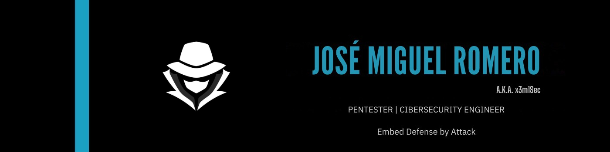

  <h1>root@github# whoami </h1>

  <h2>Hi, I’m José Miguel aka x3m1Sec</h2>
  <h3> 💻 Developer 🛡️ Cybersecurity 🔴 Red Team 👨‍💻 Pentester 📜 EJPTv2, CPHE, CPHEE </h3> 

  

  

 

  

 

  

  <picture>
    <source media="(max-width: 600px)" srcset="https://tryhackme-badges.s3.amazonaws.com/x3m1Sec.png" />
    
  </picture>
   
  <picture>
    <source media="(max-width: 600px)" srcset="http://www.hackthebox.eu/badge/image/1239916" />
    
  </picture>

